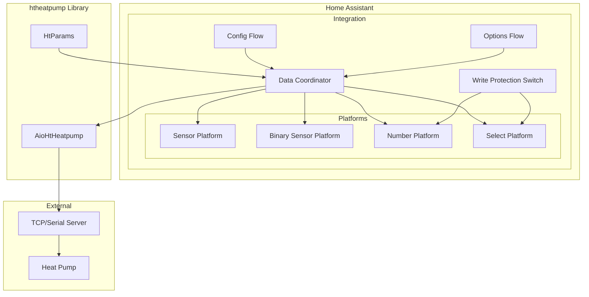
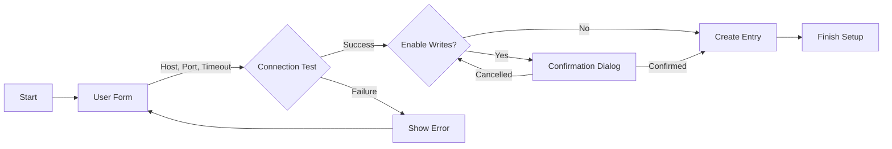
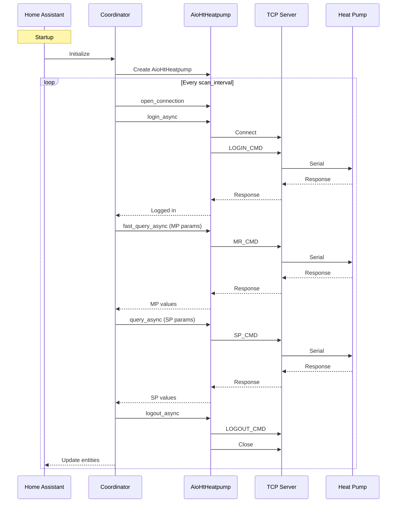

# Home Assistant Integration for Heliotherm Heat Pump

## Overview

This document outlines the architecture and implementation plan for a Home Assistant integration that uses the `htheatpump` library to manage and visualize a Heliotherm HP07S08W-S-WEB heat pump over a TCP socket connection.

## Requirements Summary

1. **Connection**: TCP socket connection via serial server box (ser2net or similar)
2. **Entity Types**:
   - Temperature sensors (outdoor, hot water, flow, return, etc.)
   - Binary sensors (fault status, pump status, compressor status)
   - Number entities for setpoint control (room temperature, hot water temperature)
   - Select entity for operating mode
3. **Parameter Exposure**: Curated set by default, configurable to add more
4. **Write Protection**: Switch requiring confirmation before enabling parameter writes

## Architecture

### Directory Structure

```
custom_components/htha/
|-- __init__.py              # Integration setup and coordinator
|-- manifest.json            # Integration metadata
|-- config_flow.py           # UI configuration flow
|-- const.py                 # Constants and configuration keys
|-- coordinator.py           # Data update coordinator
|-- entity.py                # Base entity classes
|-- sensor.py                # Temperature sensor platform
|-- binary_sensor.py         # Binary sensor platform
|-- number.py                # Number entity platform
|-- select.py                # Select entity platform
|-- switch.py                # Write protection switch
|-- options_flow.py          # Options flow for parameter selection
|-- translations/
|   |-- en.json              # English translations
|   `-- de.json              # German translations
`-- htparams.py              # Parameter definitions and mappings
```

### Component Diagram



## Detailed Component Design

### 1. Manifest - manifest.json

```json
{
    "domain": "htha",
    "name": "Ht HA",
    "codeowners": ["@silviuk"],
    "config_flow": true,
    "dependencies": [],
    "documentation": "https://github.com/silviuk/htha",
    "integration_type": "device",
    "iot_class": "local_polling",
    "issue_tracker": "https://github.com/silviuk/htha/issues",
    "quality_scale": "custom",
    "requirements": ["htheatpump>=1.3.4"],
    "version": "1.0.0"
}
```

### 2. Constants - const.py

```python
# Configuration keys
CONF_HOST = "host"
CONF_PORT = "port"
CONF_TIMEOUT = "timeout"
CONF_SCAN_INTERVAL = "scan_interval"
CONF_WRITE_ENABLED = "write_enabled"
CONF_SELECTED_PARAMS = "selected_params"

# Default values
DEFAULT_PORT = 9999
DEFAULT_TIMEOUT = 10
DEFAULT_SCAN_INTERVAL = 30

# Parameter categories for UI organization
PARAM_CATEGORIES = {
    "temperatures": [
        "Temp. Aussen",
        "Temp. Aussen verzoegert",
        "Temp. Brauchwasser",
        "Temp. Vorlauf",
        "Temp. Ruecklauf",
        "Temp. EQ_Eintritt",
        "Temp. EQ_Austritt",
        "Temp. Sauggas",
        "Temp. Frischwasser_Istwert",
        "Temp. Verdampfung",
        "Temp. Kondensation",
        "Temp. Heissgas",
    ],
    "pressures": [
        "Niederdruck (bar)",
        "Hochdruck (bar)",
    ],
    "status": [
        "Heizkreispumpe",
        "EQ Pumpe (Ventilator)",
        "Warmwasservorrang",
        "Zirkulationspumpe WW",
        "Verdichter",
        "Stoerung",
        "Hauptschalter",
        "FWS Stroemungsschalter",
    ],
    "setpoints": [
        "HKR Soll_Raum",
        "HKR RLT Soll_oHG (Heizkurve)",
        "HKR RLT Soll_0 (Heizkurve)",
        "HKR RLT Soll_uHG (Heizkurve)",
        "WW Normaltemp.",
        "WW Minimaltemp.",
    ],
    "operating_mode": [
        "Betriebsart",
    ],
    "statistics": [
        "BSZ Verdichter Schaltungen",
        "BSZ HKP Betriebsstunden",
        "BSZ EQ Betriebsstunden",
        "BSZ WWV Betriebsstunden",
    ],
}

# Default curated parameters to expose
DEFAULT_PARAMS = [
    # Temperatures
    "Temp. Aussen",
    "Temp. Brauchwasser",
    "Temp. Vorlauf",
    "Temp. Ruecklauf",
    # Status
    "Heizkreispumpe",
    "Verdichter",
    "Stoerung",
    "Warmwasservorrang",
    # Setpoints
    "HKR Soll_Raum",
    "WW Normaltemp.",
    # Operating mode
    "Betriebsart",
]
```

### 3. Config Flow - config_flow.py

The config flow will handle:
- Initial setup with host, port, timeout, and scan interval
- Connection test during setup
- Write protection confirmation dialog



### 4. Data Coordinator - coordinator.py

The coordinator will:
- Manage the AioHtHeatpump connection lifecycle
- Handle login/logout automatically
- Poll parameters at configured interval
- Use fast_query_async for MP data points
- Use query_async for SP data points
- Handle connection errors and reconnection

```python
class HtHeatpumpDataCoordinator(DataUpdateCoordinator):
    """Coordinator for htheatpump data updates."""
    
    def __init__(self, hass, host, port, timeout, scan_interval, selected_params):
        self.host = host
        self.port = port
        self.timeout = timeout
        self.selected_params = selected_params
        self.heatpump = AioHtHeatpump(url=f"tcp://{host}:{port}", timeout=timeout)
        self._connected = False
        
    async def _async_update_data(self):
        """Fetch data from heat pump."""
        if not self._connected:
            await self._connect()
        # Use fast_query for MP params, regular query for SP params
        # Return dict of parameter values
```

### 5. Entity Platforms

#### Sensor Platform - sensor.py

Temperature sensors and numeric values:
- Device class: TEMPERATURE for temperature parameters
- Unit of measurement: °C for temperatures, bar for pressures
- State class: MEASUREMENT for continuous values, TOTAL_INCREASING for counters

| Parameter | Device Class | Unit | State Class |
|-----------|--------------|------|-------------|
| Temp. Aussen | TEMPERATURE | °C | MEASUREMENT |
| Temp. Brauchwasser | TEMPERATURE | °C | MEASUREMENT |
| Temp. Vorlauf | TEMPERATURE | °C | MEASUREMENT |
| Niederdruck | PRESSURE | bar | MEASUREMENT |
| BSZ Verdichter Schaltungen | None | None | TOTAL_INCREASING |

#### Binary Sensor Platform - binary_sensor.py

Status indicators:
- Device class: appropriate class for each type
- On/off state based on boolean parameter value

| Parameter | Device Class |
|-----------|--------------|
| Stoerung | PROBLEM |
| Heizkreispumpe | RUNNING |
| Verdichter | RUNNING |
| Warmwasservorrang | RUNNING |
| Hauptschalter | POWER |

#### Number Platform - number.py

Setpoint controls:
- Min/max values from HtParams limits
- Step value based on data type (1 for INT, 0.5 for FLOAT)
- Write protection check before setting values

| Parameter | Min | Max | Step | Mode |
|-----------|-----|-----|------|------|
| HKR Soll_Raum | 10.0 | 25.0 | 0.5 | BOX |
| WW Normaltemp. | 10 | 75 | 1 | BOX |

#### Select Platform - select.py

Operating mode selection:
- Options mapped from integer values to human-readable strings
- Write protection check before setting

| Betriebsart Value | Translation Key |
|-------------------|-----------------|
| 0 | mode_off |
| 1 | mode_heating |
| 2 | mode_cooling |
| 3 | mode_hot_water |
| 4 | mode_heating_cooling |
| 5 | mode_auto |
| 6 | mode_emergency |
| 7 | mode_standby |

### 6. Write Protection Switch - switch.py

A confirmation switch that:
- Defaults to OFF (write protection enabled)
- Requires explicit user action to enable writes
- Shows confirmation dialog when turned ON
- Controls whether number and select entities can write to heat pump

### 7. Options Flow - options_flow.py

Allows users to:
- Add additional parameters from the full list
- Remove parameters from the exposed set
- Adjust scan interval
- Toggle write protection

## Data Flow



## Error Handling

1. **Connection Errors**: 
   - Log error and set entities to unavailable
   - Retry connection on next update cycle
   - Show notification in Home Assistant UI

2. **Timeout Errors**:
   - Close connection and retry
   - Configurable timeout value

3. **Write Protection**:
   - Check switch state before any write operation
   - Show user-friendly error if write is blocked
   - Log attempted writes

4. **Parameter Validation**:
   - Validate values against HtParams limits
   - Show error if value out of range

## Configuration UI Mockup

### Step 1: Connection Settings

```
+------------------------------------------+
| Heliotherm Heat Pump Setup               |
+------------------------------------------+
| Host: [192.168.1.100        ]            |
| Port: [9999                 ]            |
| Timeout (seconds): [10      ]            |
| Scan Interval (seconds): [30 ]           |
|                                          |
| [Test Connection]                        |
+------------------------------------------+
```

### Step 2: Write Protection

```
+------------------------------------------+
| Write Protection Settings                |
+------------------------------------------+
| Enable parameter writes?                 |
|                                          |
| [ ] Yes, enable writes to heat pump      |
|                                          |
| Warning: Enabling writes allows changing |
| heat pump settings. Use with caution!    |
+------------------------------------------+
```

### Step 3: Parameter Selection (Options)

```
+------------------------------------------+
| Parameter Selection                      |
+------------------------------------------+
| Select additional parameters to expose:  |
|                                          |
| Temperatures:                            |
| [x] Temp. Aussen (default)               |
| [x] Temp. Brauchwasser (default)         |
| [ ] Temp. Aussen verzoegert              |
| [ ] Temp. EQ_Eintritt                    |
|                                          |
| Status:                                  |
| [x] Stoerung (default)                   |
| [x] Verdichter (default)                 |
| [ ] FWS Stroemungsschalter               |
|                                          |
| Setpoints:                               |
| [x] HKR Soll_Raum (default)              |
| [ ] HKR Heizgrenze                       |
+------------------------------------------+
```

## Implementation Phases

### Phase 1: Core Integration
1. Create directory structure and manifest
2. Implement config flow with connection test
3. Implement coordinator with basic polling
4. Create sensor and binary_sensor platforms

### Phase 2: Control Entities
1. Implement write protection switch
2. Create number platform for setpoints
3. Create select platform for operating mode

### Phase 3: Configuration UI
1. Implement options flow for parameter selection
2. Add translations for UI strings
3. Create device registry entries

### Phase 4: Polish and Testing
1. Write unit tests
2. Add error handling and recovery
3. Create documentation

## Dependencies

- Home Assistant >= 2024.1.0
- htheatpump >= 1.0.0
- aioserial (for serial connections, optional)

## Testing Strategy

1. **Unit Tests**: Mock AioHtHeatpump and test coordinator logic
2. **Integration Tests**: Test config flow and entity creation
3. **Manual Testing**: Test with actual heat pump or simulator

## Future Enhancements

1. Time program management (read/write time schedules)
2. Fault list display and notifications
3. Energy monitoring and statistics
4. Climate entity for integrated temperature control
5. Support for multiple heat pumps